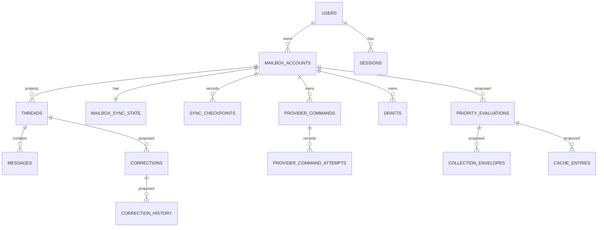
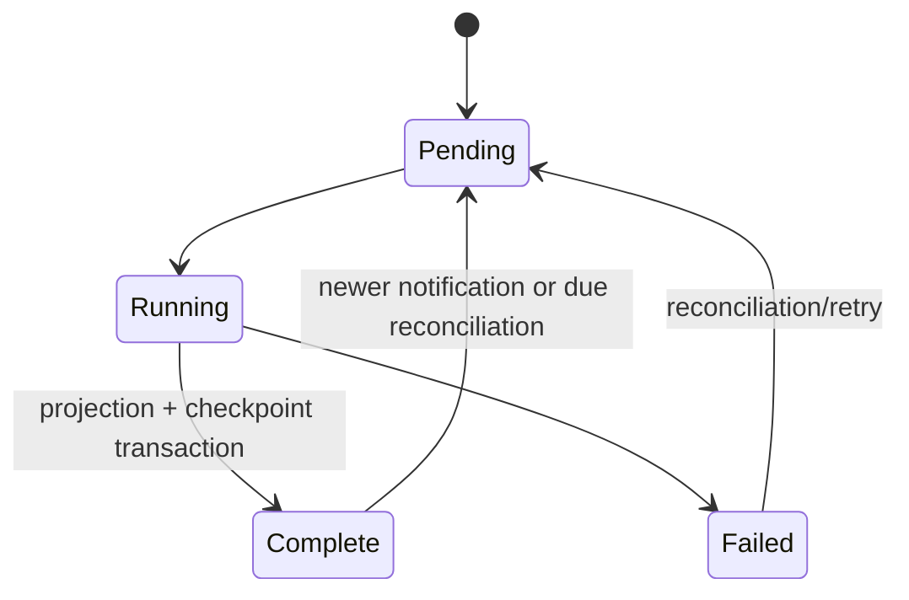
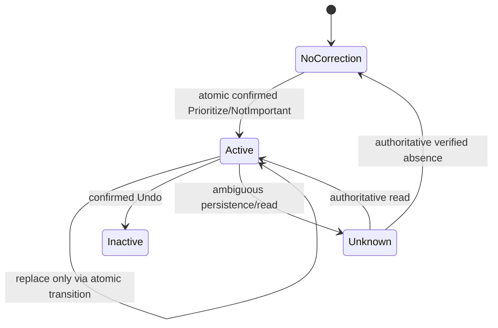
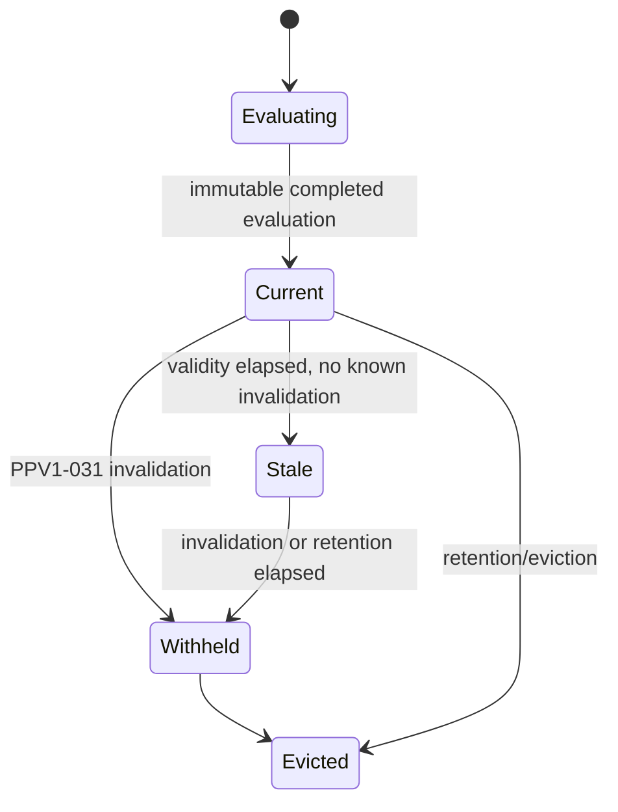

# Data and State Model v1

## Document control and status

| Field | Value |
| --- | --- |
| Status | Current PostgreSQL model plus proposed PPV1 model |
| Version | 1.0 |
| Related | [Priority Policy](../product/priority-policy-v1.md), [Product architecture](product-architecture-v1.md), [AI Email Organizer interface specification](../design/ai-email-organizer-interface-spec-v1.md) |

## Purpose and current persistence evidence

PostgreSQL is the durable system of record for users, sessions, Gmail connection state, normalized metadata projections, synchronization, commands, drafts, audit/outbox events, and worker heartbeats. Redis/BullMQ is operational queue/cache infrastructure, not durable truth. Current migrations are `001`, `002`, and `004`–`015`; there are no priority evaluation/correction/cache tables. Consequently PPV1 entities are **Proposed architecture**.

## Entity inventory and requirements

| Entity | Current/source/ownership | Lifecycle, privacy, indexes/status |
| --- | --- | --- |
| Owner (`users`) | application-owned UUID; email unique; owner root | soft delete field; personal data; `email_normalized` unique; implemented |
| Session | UUID, user FK; server authority | created/revoked/expired, cascade delete; token hash sensitive; unique hash/active-user index; implemented |
| Mailbox/provider connection | mailbox UUID, user FK; Gmail identity/provider authoritative; encrypted refresh token | active/reauth/disconnected/sync failed; cascades; sensitive credential/address; provider/account and owner/provider/email uniqueness; implemented |
| OAuth/token reference | encrypted refresh token in mailbox row; OAuth provider authoritative | replacement after verified grant; blanked on disconnect; secret; no plaintext index; implemented |
| Application thread identity / Provider Binding | canonical app `threadId`; owner/mailbox/provider locator binding | durable, immutable identity; binding active/suspended/retired; permanent non-reuse; **Proposed**, required by WSF-011 and PPV1-022 |
| Thread projection | canonical `threadId` FK + mailbox FK; Gmail metadata authoritative | upserted/reconciled mutable projection; projection deletion does not delete canonical identity or retained Provider Binding; current schema is not compliant |
| Message projection | app UUID + thread FK/provider message ID; Gmail metadata authoritative | upserted, cascade delete; headers/snippet metadata personal; unique `(thread, provider_message_id)`; implemented |
| Labels/locations | `provider_labels` on messages/threads; Gmail authoritative | overwritten by sync; metadata; GIN labels index; implemented, but PPV1 verified current location state is not implemented |
| Synchronization checkpoint/state | mailbox FK; Gmail history authoritative | pending/running/complete/failed; retained with mailbox, cascade; operational metadata; one per mailbox and reconciliation index; implemented |
| Provider command/attempt | command UUID + mailbox FK; provider confirmation authoritative | pending/running/retryable/terminal/recovery; encrypted payload; mailbox/idempotency unique and due/attempt indexes; implemented |
| Correction / history | **Proposed**, owner-scoped application authority | active/inactive/Unknown; correction history append-only; privacy-sensitive preference; no schema |
| Priority evaluation / collection envelope / cache entry | **Proposed**, evaluator authority over immutable derived result | created, current/stale/withheld/evicted; derived metadata; no schema |
| Runtime verification event | existing audit/metrics are related; PPV1 event **Proposed** | append-only, privacy-safe, policy-version segmented; no PPV1 schema |
| Jobs/retry records | outbox, provider attempts, worker heartbeats; system authority | transactional publish/lease/retry; operational data; implemented |

## Required PPV1 entities and invariants (proposed)

`thread_provider_bindings` must preserve the canonical application `threadId`, owner ID, mailbox ID, provider, provider account locator, provider thread locator, lifecycle state, and immutable transition identity. Enforce owner/mailbox isolation, one binding target per scoped provider locator, permanent `threadId` non-reuse, and explicit audited replacement. Mutable projection rows may be rebuilt without reallocating identity. PPV1-022 is the sole semantic authority.

`corrections` must contain a stable UUID, owner ID, mailbox ID, canonical application `threadId`, correction kind, state, creation/transition timestamps, and idempotency identity. Enforce a partial unique index for at most one active correction per owner-scoped thread. Transition active state with a transaction/row lock or compare-and-swap; write immutable `correction_history` in the same transaction. Undo is idempotent: repeated identical undo resolves to one inactive state and history event. Failed/ambiguous persistence is `Unknown`, never verified absence.

`priority_evaluations` must include immutable evaluation ID, owner/mailbox/canonical-`threadId` scope, applicable Provider Binding transition identity, exact `policyVersion`, approved parameter identity, canonical input snapshot fingerprint, output `tier`, ordered reason codes/reasons/roles, fixed `evaluatedAt`, `validThrough`, `staleRetentionThrough`, invalidation state/cause, and canonical serialization. Completion freezes all evaluation facts; cache retrieval never advances `evaluatedAt`. WSF-011 and PPV1-022 resolve permanent application-thread identity and non-reuse; the current UUID/FK schema does not implement the required durable binding lifecycle.

`collection_envelopes` must be immutable evaluation facts plus separate mutable presentation state: candidate scope/eligibility, synchronization coverage, evidence completeness, delivery completeness, freshness, and provider availability. Unknown and malformed evidence are distinct from verified absence. Stale cannot improve any of those facts.

`cache_entries` must reference immutable evaluation output and carry a keyed, purpose-scoped collision-resistant snapshot fingerprint. A cache read independently verifies authenticated owner and mailbox (F05); key construction includes owner, mailbox, policy version, approved parameters, candidate scope, canonical inputs, and purpose/schema domain (F06). No cross-policy reuse. Expired or known-invalid entries are never presented.

## State diagrams

## Transaction, concurrency, and invalidation boundaries

Existing sync persists projections and advances checkpoint in one transaction, guarding monotonic history with `FOR UPDATE`; reconciliation claims use `SKIP LOCKED`; per-mailbox advisory locks serialize sync. Existing command insertion atomically writes command/outbox, commands use lease claims and unique idempotency keys, and attempts are recorded.

**Proposed:** correction transition + history + PPV1-031 outbox invalidation must be one transaction (F04/F07). Projection/sync and authoritative command reconciliation must write semantic invalidation in their same commit or cause affected results to be withheld before presentation. Consumers must be idempotent. Cache writes need compare-and-swap against current policy/parameter/snapshot identity; concurrent identical work may coalesce but cannot mix outputs.

## Deletion, reconnect, retention, and migration

Current mailbox disconnect clears its encrypted token without deleting the mailbox row; reconnect to the same durable provider account reuses that row. WSF-011 and PPV1-022 require retained canonical `threadId` and Provider Binding identity across that lifecycle and prohibit identity reuse. Retention duration, legal deletion, and cache retention remain separate launch/operational decisions. Migrations must preserve existing valid thread UUIDs, create Provider Bindings without evidence inference, fail conflicting mappings safely, introduce nullable/Unknown-safe fields and constraints first, then deploy writers/readers and invalidate legacy derived results.

## Required constraints, indexes, and tests

- owner/mailbox composite scope indexes on every PPV1 read path; FK chains plus authorization verification.
- unique scoped Provider Binding target; canonical `threadId` non-reuse; explicit binding-transition identity; migration conflict-failure tests.
- unique active correction `(owner_id, mailbox_id, thread_id)` partial index; immutable correction-history insert-only permissions/trigger or repository discipline.
- unique canonical cache identity including policy/version/parameters/purpose snapshot; indexed expiration and invalidation state.
- tests for cross-owner/mailbox denial, stable `threadId` across sync/rebuild/reconnect, permanent non-reuse, Provider Binding replacement and migration conflicts, atomic competing corrections, immutable history, idempotent Undo, Provider Star present/absent/Unknown mapping, completed evaluation immutability, fixed clock, canonical reason registry, WSF-008 boundaries, policy separation, read-time cache verification, fingerprint collision behavior, sync/command invalidation, stale/expired withholding, telemetry content exclusion, and determining/supporting reason roles.

## Traceability to Priority Policy

| Data responsibility | PPV1 sections |
| --- | --- |
| location/evidence/Unknown normalization | PPV1-001–004 |
| tiers, reasons, ordering/time | PPV1-011–024 |
| correction lifecycle | PPV1-025–029 |
| validity/cache/invalidation | PPV1-030–033, 046 |
| envelope and presentation state | PPV1-034–037 |
| privacy/replay/operational verification | PPV1-044–046 |

## Evaluator findings and unresolved data-model decisions

F01 reason behavior is owned by PPV1-012 and PPV1-016 through PPV1-019. The data model must persist the ordered canonical reason registry output and determining/supporting role without restating the semantics.

F02 is resolved by WSF-008 and PPV1-024. The data model stores the approved parameter identity and fixed `evaluatedAt`; it does not define the tolerance.

F03 is resolved by WSF-011 and PPV1-022. The required Provider Binding model and migration remain implementation work. WSF-009 Provider Star state and WSF-010 reason output also require executable contracts and fixtures. F04–F08 require the proposed controls above; F11 requires the product interface specification's accessibility contracts. Migration defaults must not silently settle unrelated product-policy TODOs.

## Source Evidence

- `packages/database/migrations/001_milestone_one.sql` through `015_normalize_thread_projection_metadata.sql`
- `packages/database/src/repositories/mailbox-sync-repository.ts`, `thread-projection-repository.ts`, `provider-command.ts`
- `packages/contracts/src/index.ts`, `packages/gmail/src/thread-metadata.ts`, `apps/worker/src/sync-state.ts`, `apps/api/src/routes/thread-mutations.ts`
- [Priority Policy](../product/priority-policy-v1.md), [product architecture](product-architecture-v1.md), [AI Email Organizer interface specification](../design/ai-email-organizer-interface-spec-v1.md)

## Claims Not Yet Supported by Source

There are no implemented corrections, correction histories, priority evaluations, collection envelopes, PPV1 cache entries, runtime verification events, active-correction uniqueness constraint, or PPV1 invalidation wiring in the repository.
